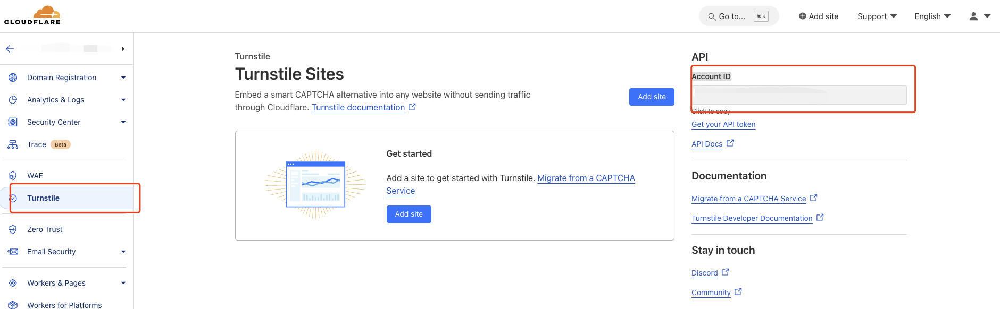
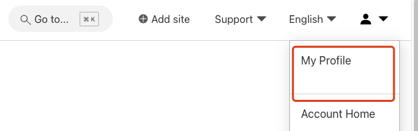
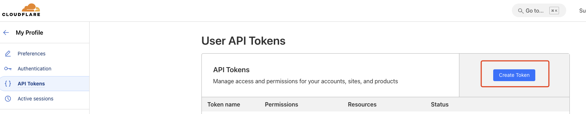
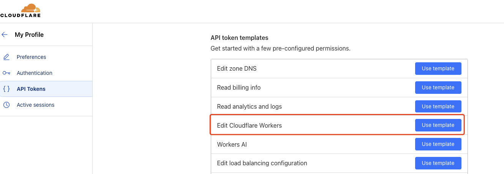
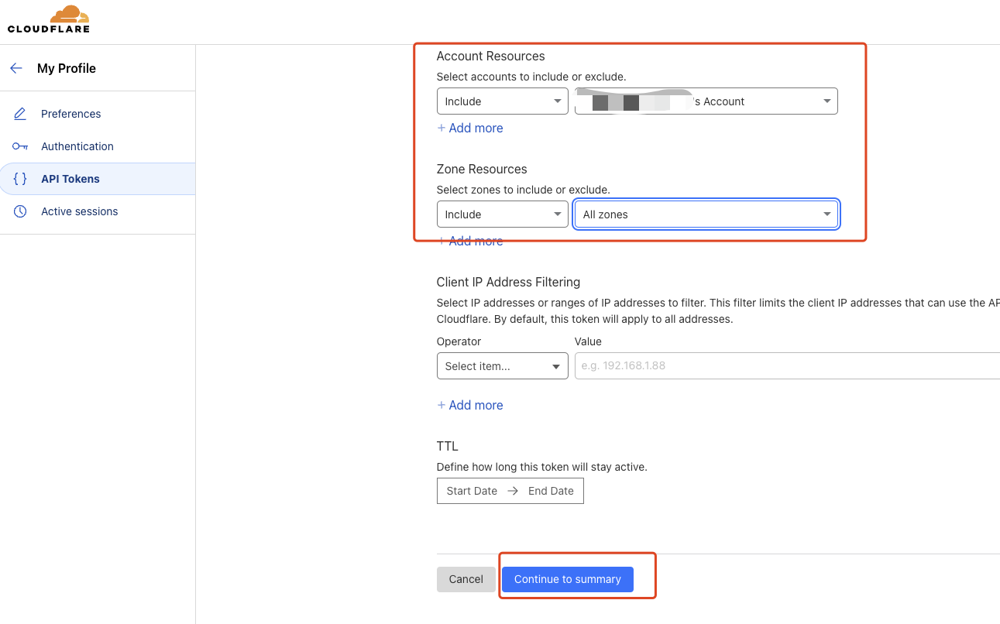
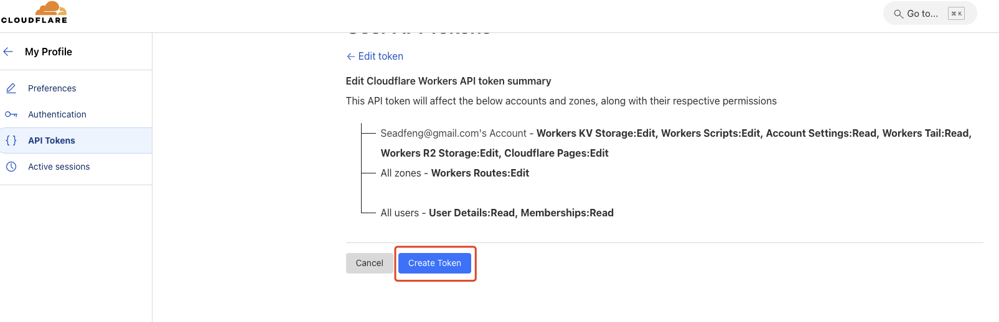
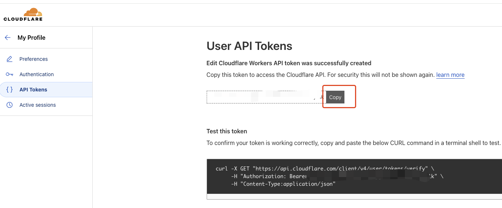
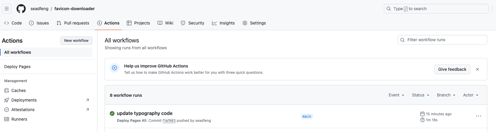
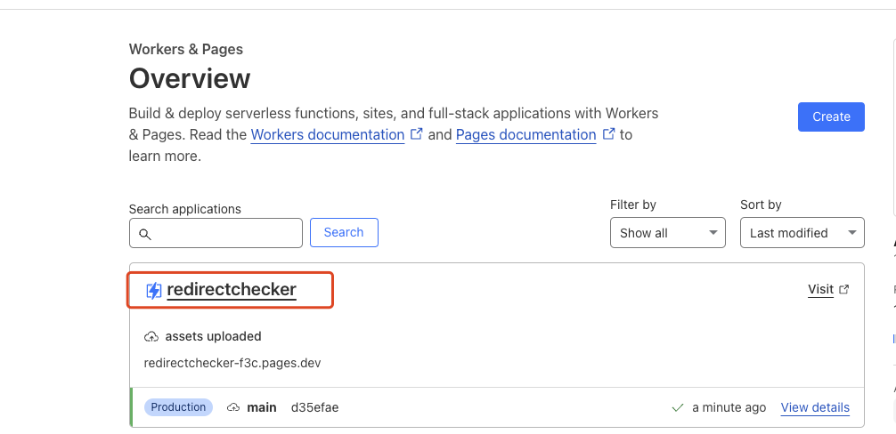
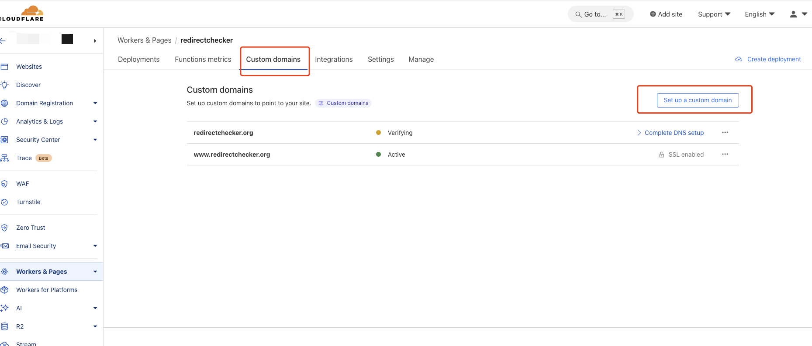

# Redirect Checker: Github Actions Guide

GitHub Actions is a CI/CD platform provided by GitHub that allows developers to automate their software development workflows. It enables you to define and automate tasks such as building, testing, and deploying code directly within your GitHub repository.

## About Github Actions

### Key Concepts

- **Workflow**: A workflow is an automated process defined in YAML files located in the `.github/workflows/` directory of your repository. It consists of one or more jobs that execute specific tasks.
- **Job**: A job is a set of steps that execute on the same runner. Jobs can run sequentially or in parallel, depending on the configuration.
- **Step**: Steps are individual tasks within a job. Each step can be a shell command or an action. Steps run in the order they are defined.
- **Action**: An action is a reusable unit of code that performs a specific task. GitHub provides many built-in actions, and you can also create custom actions or find them in the GitHub Marketplace.

### Main Uses

- **CI/CD**: Automate the processes of building, testing, and deploying code.
- **Automation**: Automate common tasks such as running tests on pull requests or generating release notes when a new version is published.
- **Integration**: Seamlessly integrate with DevOps processes and manage infrastructure automatically.

GitHub Actions helps streamline development workflows, reduce manual errors, and ensure that code is thoroughly tested before deployment.

## Environment for Redirect Checker Github Actions

### Cloudflare Account ID

### Cloudflare API Token

1. Go to **my profile**

2. Create Token

2. 1. Use template: Edit Cloudflare Workers

2. 2. Configuration

- Account Resources
- Zone Resources

2. 3. Confirm and create token

3. Copy Token

## Update your Git Repository

### Check Your Git Repository Actions

 

After the Action is completed, go to Cloudflare Workers & Pages and find the project named redirectchecker.

### Custom domains

After SSL enabled, it may be working 